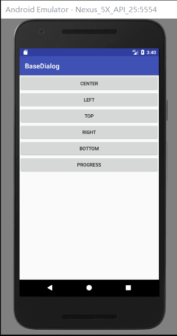
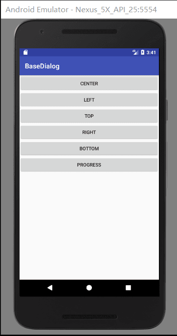

[CSDN](https://blog.csdn.net/confusing_awakening/article/details/78332459)

[APK](https://github.com/AnJiaoDe/BaseDialog/tree/master/app/build/outputs/apk)

如有任何问题或者是建议，可以QQ群:安娇德IT技术交流群757173381讨论，开源库会根据需求持续更新。

**使用方法**

将libray模块复制到项目中,或者直接在build.gradle中依赖:

```
allprojects {
		repositories {
			
			maven { url 'https://jitpack.io' }
		}
	}
```

```
dependencies {
	        compile 'com.github.AnJiaoDe:BaseDialog:V1.1.1'
	}
```

**1.Center**


```
<?xml version="1.0" encoding="utf-8"?>
<LinearLayout xmlns:android="http://schemas.android.com/apk/res/android"
    android:layout_width="wrap_content"
    android:layout_height="wrap_content"
    android:layout_marginLeft="20dp"
    android:layout_marginRight="20dp"
    android:background="@drawable/white_shape"
    android:orientation="vertical">
    <TextView
        android:layout_width="match_parent"
        android:layout_height="80dp"
        android:text="确定删除吗？"
        android:textSize="16sp"
        android:gravity="center"/>
    <View
        android:layout_width="match_parent"
        android:layout_height="1dp"
        android:background="@color/line"/>
    <LinearLayout
        android:layout_width="match_parent"
        android:layout_height="wrap_content"
        android:orientation="horizontal">
        <TextView
            android:layout_width="0dp"
            android:layout_weight="1"
            android:layout_height="48dp"

            android:text="取消"
            android:id="@+id/tv_cancel"
            android:gravity="center"
            android:textSize="16sp"/>
        <View
            android:layout_width="1dp"
            android:layout_height="match_parent"
            android:background="@color/line"/>
        <TextView
            android:layout_width="0dp"
            android:layout_weight="1"
            android:id="@+id/tv_confirm"
            android:layout_height="48dp"
            android:text="确定"
            android:gravity="center"

            android:textSize="16sp"/>
    </LinearLayout>
</LinearLayout>
```
**2.Left**


```
<?xml version="1.0" encoding="utf-8"?>
<LinearLayout xmlns:android="http://schemas.android.com/apk/res/android"
    android:layout_width="250dp"
    android:layout_height="match_parent"
    android:background="@color/white"

    android:orientation="vertical">

    <TextView
        android:layout_width="match_parent"
        android:layout_height="wrap_content"
        android:padding="10dp"
        android:text="Google Assistant: 一句 OK, Google，多少手指都用不上了
人工智能是今年的 Google I/O 的一大主题。在发布会一开始，Google CEO 桑达拉·皮蔡（Sundar Pichai）就强调机器学习在生活中扮演的重要角色。随后，一系列基于 Google 人工智能的产品纷至沓来。


OK, Google. 这句耳熟能详的命令，如今承载了 Google 全新的产品——Google Assistant.

之所以 Google Assistant 是发布会上首个亮相的产品，是因为后续登场的数个产品都基于这一技术。Google 用将近十年的时间，改善自己的语音识别技术，更强调自然语义和对话式搜索。"
        android:textSize="16sp" />

</LinearLayout>
```

**3.Top**


```
<?xml version="1.0" encoding="utf-8"?>
<LinearLayout xmlns:android="http://schemas.android.com/apk/res/android"
    android:layout_width="match_parent"
    android:layout_height="match_parent"
    android:background="@color/white"
    android:orientation="vertical">

    <LinearLayout
        android:layout_width="match_parent"
        android:layout_height="wrap_content"
        android:orientation="vertical">

        <TextView
            android:id="@+id/tv_photo"
            android:layout_width="match_parent"
            android:layout_height="56dp"
            android:gravity="center"
            android:text="拍照"
            android:textSize="16sp" />

        <View
            android:layout_width="match_parent"
            android:layout_height="0.1dp"
            android:background="@color/line" />

        <TextView

            android:id="@+id/tv_album"
            android:layout_width="match_parent"
            android:layout_height="56dp"
            android:gravity="center"
            android:text="从相册选择"

            android:textSize="16sp" />
    </LinearLayout>
    <View
        android:layout_width="match_parent"
        android:layout_height="10dp"
        android:background="@color/bg"/>
    <TextView
        android:id="@+id/tv_photo_cancel"
        android:layout_width="match_parent"
        android:layout_height="56dp"
        android:gravity="center"
        android:text="取消"

        android:textSize="16sp" />
</LinearLayout>
```

**4.Right**




```
<?xml version="1.0" encoding="utf-8"?>
<LinearLayout xmlns:android="http://schemas.android.com/apk/res/android"
    android:layout_width="250dp"
    android:layout_height="match_parent"
    android:background="@color/white"

    android:orientation="vertical">

    <TextView
        android:layout_width="match_parent"
        android:layout_height="wrap_content"
        android:padding="10dp"
        android:text="Google Assistant: 一句 OK, Google，多少手指都用不上了
人工智能是今年的 Google I/O 的一大主题。在发布会一开始，Google CEO 桑达拉·皮蔡（Sundar Pichai）就强调机器学习在生活中扮演的重要角色。随后，一系列基于 Google 人工智能的产品纷至沓来。


OK, Google. 这句耳熟能详的命令，如今承载了 Google 全新的产品——Google Assistant.

之所以 Google Assistant 是发布会上首个亮相的产品，是因为后续登场的数个产品都基于这一技术。Google 用将近十年的时间，改善自己的语音识别技术，更强调自然语义和对话式搜索。"
        android:textSize="16sp" />

</LinearLayout>
```

**5.Bottom**


```
<?xml version="1.0" encoding="utf-8"?>
<LinearLayout xmlns:android="http://schemas.android.com/apk/res/android"
    android:layout_width="match_parent"
    android:layout_height="match_parent"
    android:background="@color/white"
    android:orientation="vertical">

    <LinearLayout
        android:layout_width="match_parent"
        android:layout_height="wrap_content"
        android:orientation="vertical">

        <TextView
            android:id="@+id/tv_photo"
            android:layout_width="match_parent"
            android:layout_height="56dp"
            android:gravity="center"
            android:text="拍照"
            android:textSize="16sp" />

        <View
            android:layout_width="match_parent"
            android:layout_height="0.1dp"
            android:background="@color/line" />

        <TextView

            android:id="@+id/tv_album"
            android:layout_width="match_parent"
            android:layout_height="56dp"
            android:gravity="center"
            android:text="从相册选择"

            android:textSize="16sp" />
    </LinearLayout>
    <View
        android:layout_width="match_parent"
        android:layout_height="10dp"
        android:background="@color/bg"/>
    <TextView
        android:id="@+id/tv_photo_cancel"
        android:layout_width="match_parent"
        android:layout_height="56dp"
        android:gravity="center"
        android:text="取消"

        android:textSize="16sp" />
</LinearLayout>
```

**6.Progress**


 
 

```
package com.cy.basedialog;

import android.os.Bundle;
import android.view.Gravity;
import android.view.View;
import android.view.WindowManager;

import com.cy.dialog.BaseDialog;
import com.cy.dialog.progress.CYProgressDialog;

public class MainActivity extends BaseActivity {
    private BaseDialog dialog;

    @Override
    protected void onCreate(Bundle savedInstanceState) {
        super.onCreate(savedInstanceState);
        setContentView(R.layout.activity_main);
        findViewById(R.id.btn_center).setOnClickListener(this);
        findViewById(R.id.btn_left).setOnClickListener(this);
        findViewById(R.id.btn_top).setOnClickListener(this);
        findViewById(R.id.btn_right).setOnClickListener(this);
        findViewById(R.id.btn_bottom).setOnClickListener(this);
        findViewById(R.id.btn_progress).setOnClickListener(this);

    }

    @Override
    public void onClick(View v) {

        switch (v.getId()) {
            case R.id.btn_center:
                dialog = new BaseDialog(this);

                dialog.config(R.layout.dialog_center, true).show();
                dialog.findViewById(R.id.tv_confirm).setOnClickListener(this);
                dialog.findViewById(R.id.tv_cancel).setOnClickListener(this);

                break;
            case R.id.btn_left:
                BaseDialog dialog_left = new BaseDialog(this);

                dialog_left.config(R.layout.dialog_left, 0.5f, Gravity.LEFT | Gravity.CENTER, BaseDialog.AnimInType.LEFT,
                        WindowManager.LayoutParams.WRAP_CONTENT, WindowManager.LayoutParams.MATCH_PARENT, true).show();

                break;
            case R.id.btn_top:
                BaseDialog dialog_top = new BaseDialog(this);

                dialog_top.setOffset(0, ScreenUtils.dpInt2px(this, 48));

                dialog_top.config(R.layout.dialog_photo, 0.5f, Gravity.TOP, BaseDialog.AnimInType.TOP,
                        WindowManager.LayoutParams.MATCH_PARENT, WindowManager.LayoutParams.WRAP_CONTENT, true).show();


                break;
            case R.id.btn_right:
                BaseDialog dialog_right = new BaseDialog(this);

                dialog_right.setOffset(20, 0);

                dialog_right.config(R.layout.dialog_right, Gravity.RIGHT | Gravity.CENTER, BaseDialog.AnimInType.RIGHT,
                        WindowManager.LayoutParams.WRAP_CONTENT, WindowManager.LayoutParams.MATCH_PARENT, true).show();
                break;
            case R.id.btn_bottom:
                BaseDialog dialog_bottom = new BaseDialog(this);

                dialog_bottom.config(R.layout.dialog_photo, Gravity.BOTTOM, BaseDialog.AnimInType.BOTTOM, true).show();


                break;
            case R.id.btn_progress:

                CYProgressDialog cyProgressDialog=new CYProgressDialog(this);
                cyProgressDialog.config(0.4f,0xffffffff,20,0xffffffff,0xff2a5caa).show();
                break;
            case R.id.tv_confirm:
                dialog.dismiss();
                break;
            case R.id.tv_cancel:
                dialog.dismiss();
                break;
        }

    }
}

```

 **源码：**
 
 **BaseDialog**

```
package com.cy.dialog;

import android.app.Dialog;
import android.content.Context;
import android.support.annotation.LayoutRes;
import android.support.annotation.NonNull;
import android.support.annotation.Nullable;
import android.view.Gravity;
import android.view.View;
import android.view.ViewGroup;
import android.view.Window;
import android.view.WindowManager;


/**
 * Created by lenovo on 2017/7/17.
 */

public class BaseDialog extends Dialog {

    public BaseDialog(Context context) {
        this(context, 0);

    }

    public BaseDialog(Context context, int themeResId) {
        super(context, themeResId);
        requestWindowFeature(Window.FEATURE_NO_TITLE);// 去除对话框的标题
        getWindow().setBackgroundDrawableResource(R.drawable.dialog_bg);//设置对话框边框背景,必须在代码中设置对话框背景，不然对话框背景是黑色的

        setDimAmount(0.2f);
    }

    /*
             */
    public BaseDialog config(@LayoutRes int layoutResID, boolean canceledOnTouchOutside) {


        config(layoutResID, 0.2f, Gravity.CENTER, AnimInType.CENTER, WindowManager.LayoutParams.MATCH_PARENT,
                WindowManager.LayoutParams.WRAP_CONTENT, canceledOnTouchOutside);

        return this;
    }

    /*
             */
    public BaseDialog config(@NonNull View view, boolean canceledOnTouchOutside) {


        config(view, 0.2f, Gravity.CENTER, AnimInType.CENTER, WindowManager.LayoutParams.MATCH_PARENT,
                WindowManager.LayoutParams.WRAP_CONTENT, canceledOnTouchOutside);

        return this;
    }

    /*
             */
    public BaseDialog config(@LayoutRes int layoutResID, int gravity, AnimInType animInType, boolean canceledOnTouchOutside) {

        config(layoutResID, 0.2f, gravity, animInType, WindowManager.LayoutParams.MATCH_PARENT,
                WindowManager.LayoutParams.WRAP_CONTENT, canceledOnTouchOutside);


        return this;
    }

    /*
             */
    public BaseDialog config(@NonNull View view, int gravity, AnimInType animInType, boolean canceledOnTouchOutside) {

        config(view, 0.2f, gravity, animInType, WindowManager.LayoutParams.MATCH_PARENT,
                WindowManager.LayoutParams.WRAP_CONTENT, canceledOnTouchOutside);


        return this;
    }

    /*
             */
    public BaseDialog config(@LayoutRes int layoutResID, int gravity, AnimInType animInType,
                             int width, int height, boolean canceledOnTouchOutside) {

        config(layoutResID, 0.2f, gravity, animInType, width, height, canceledOnTouchOutside);

        return this;
    }

    /*
             */
    public BaseDialog config(@NonNull View view, int gravity, AnimInType animInType,
                             int width, int height, boolean canceledOnTouchOutside) {

        config(view, 0.2f, gravity, animInType, width, height, canceledOnTouchOutside);

        return this;
    }

    /*
           参数：dimAmount背景阴影
            */
    public BaseDialog config(@LayoutRes int layoutResID, float dimAmount, int gravity, AnimInType animInType,
                             int width, int height, boolean canceledOnTouchOutside) {
        setContentView(layoutResID);//填充对话框布局


        setDimAmount(dimAmount);

        getWindow().setGravity(gravity);

        setAnimType(animInType);


        getWindow().setLayout(width, height);

        setCanceledOnTouchOutside(canceledOnTouchOutside ? true : false);
        return this;
    }

    /*
           参数：dimAmount背景阴影
            */
    public BaseDialog config(@NonNull View view, float dimAmount, int gravity, AnimInType animInType,
                             int width, int height, boolean canceledOnTouchOutside) {
        setContentView(view);//填充对话框布局


        setDimAmount(dimAmount);

        getWindow().setGravity(gravity);

        setAnimType(animInType);


        getWindow().setLayout(width, height);

        setCanceledOnTouchOutside(canceledOnTouchOutside ? true : false);
        return this;
    }

    /*
           参数：dimAmount背景阴影
            */
    public BaseDialog config(@NonNull View view, @Nullable ViewGroup.LayoutParams params, float dimAmount, int gravity, AnimInType animInType,
                             int width, int height, boolean canceledOnTouchOutside) {
        setContentView(view, params);//填充对话框布局


        setDimAmount(dimAmount);

        getWindow().setGravity(gravity);

        setAnimType(animInType);


        getWindow().setLayout(width, height);

        setCanceledOnTouchOutside(canceledOnTouchOutside ? true : false);
        return this;
    }

    /*
    动画类型
     */
    public BaseDialog setAnimType(AnimInType animInType) {

        if (animInType == AnimInType.CENTER) {
            getWindow().setWindowAnimations(R.style.dialog_zoom);
            return this;

        }
        if (animInType == AnimInType.LEFT) {
            getWindow().setWindowAnimations(R.style.dialog_anim_left);
            return this;

        }
        if (animInType == AnimInType.TOP) {
            getWindow().setWindowAnimations(R.style.dialog_anim_top);
            return this;

        }
        if (animInType == AnimInType.RIGHT) {
            getWindow().setWindowAnimations(R.style.dialog_anim_right);
            return this;

        }
        if (animInType == AnimInType.BOTTOM) {
            getWindow().setWindowAnimations(R.style.dialog_anim_bottom);
            return this;

        }
        return this;
    }

    public void setOffset(int x, int y) {
        WindowManager.LayoutParams layoutParams = getWindow().getAttributes();
        layoutParams.x = x;
        layoutParams.y = y;


    }

    public float getDimAmount() {
        return getWindow().getAttributes().dimAmount;
    }

    /*
    设置背景阴影,必须setContentView之后调用才生效
     */
    public BaseDialog setDimAmount(float dimAmount) {


        WindowManager.LayoutParams lp = getWindow().getAttributes();
        lp.dimAmount = dimAmount;

        return this;
    }


    /*
    动画类型
     */
    public enum AnimInType {
        CENTER(0),
        LEFT(2),
        TOP(4),
        RIGHT(3),
        BOTTOM(1);

        AnimInType(int n) {
            intType = n;
        }

        final int intType;
    }
}

```

 **CYProgressDialog**

```
package com.cy.dialog.progress;

import android.animation.ValueAnimator;
import android.content.Context;
import android.content.DialogInterface;
import android.view.KeyEvent;
import android.view.WindowManager;
import android.view.animation.DecelerateInterpolator;
import android.widget.FrameLayout;

import com.cy.dialog.BaseDialog;


/**
 * Created by lenovo on 2017/12/20.
 */

public class CYProgressDialog extends BaseDialog {

    private MaterialProgressDrawable mProgress;

    private ValueAnimator valueAnimator;

    public CYProgressDialog(Context context) {
        super(context);
        setCanceledOnTouchOutside(false);

    }

    /**
     * @param color_iv
     * @param radius_iv
     * @param color_bg_progress
     * @param colors_progress
     * @return
     */

    public CYProgressDialog config(int color_iv, float radius_iv, int color_bg_progress, int... colors_progress) {
        config(0.2f, color_iv, radius_iv, color_bg_progress, colors_progress);


        return this;
    }

    public CYProgressDialog config(float dimAmount, int color_iv, float radius_iv, int color_bg_progress, int... colors_progress) {


        FrameLayout frameLayout = new FrameLayout(getContext());


        CircleImageView imageView = new CircleImageView(getContext(), color_iv, radius_iv);


        mProgress = new MaterialProgressDrawable(getContext(), imageView);


        mProgress.setBackgroundColor(color_bg_progress);
        //圈圈颜色,可以是多种颜色
        mProgress.setColorSchemeColors(colors_progress);
        //设置圈圈的各种大小
        mProgress.updateSizes(MaterialProgressDrawable.DEFAULT);

        mProgress.showArrow(false);
        imageView.setImageDrawable(mProgress);

        frameLayout.addView(imageView);


        valueAnimator = valueAnimator.ofFloat(0f, 1f);
        valueAnimator.setDuration(600);
        valueAnimator.setInterpolator(new DecelerateInterpolator());
        valueAnimator.addUpdateListener(new ValueAnimator.AnimatorUpdateListener() {
            @Override
            public void onAnimationUpdate(ValueAnimator animation) {
                float n = (float) animation.getAnimatedValue();
                //圈圈的旋转角度
                mProgress.setProgressRotation(n * 0.5f);
                //圈圈周长，0f-1F
                mProgress.setStartEndTrim(0f, n * 0.8f);
                //箭头大小，0f-1F
                mProgress.setArrowScale(n);
                //透明度，0-255
                mProgress.setAlpha((int) (255 * n));
            }
        });

        getWindow().setLayout(WindowManager.LayoutParams.WRAP_CONTENT, WindowManager.LayoutParams.WRAP_CONTENT);
        setContentView(frameLayout);


        setDimAmount(dimAmount);

        setOnKeyListener(new OnKeyListener() {
            @Override
            public boolean onKey(DialogInterface dialog, int keyCode, KeyEvent event) {

                if (keyCode == KeyEvent.KEYCODE_BACK && event.getAction() == KeyEvent.ACTION_DOWN) {
                    hide();
                    return true;
                }
                return false;
            }
        });

        return this;
    }

    @Override
    public void show() {
        super.show();
        if (mProgress == null) return;

        mProgress.start();
        if (valueAnimator == null) return;

        valueAnimator.start();


    }

    @Override
    public void hide() {
        super.hide();
        if (mProgress == null) return;

        mProgress.stop();
        if (valueAnimator == null) return;

        valueAnimator.cancel();


    }

    public void setBackgroundColor(int color) {
        if (mProgress == null) return;

        mProgress.setBackgroundColor(color);

    }

    public void setColorSchemeColors(int... colors) {
        if (mProgress == null) return;

        mProgress.setColorSchemeColors(colors);

    }
}

```

 参考：[Android Dialog](https://blog.csdn.net/confusing_awakening/article/category/6898373)
 
 **更新日志**
 
 *V1.1.1*
  - Android BaseDialog(开发必备)动画、加载进度、阴影、上下左右中 进入
  
  

**License**

 Copyright [AnJiaoDe] [name of copyright owner]

   Licensed under the Apache License, Version 2.0 (the "License");
   you may not use this file except in compliance with the License.
   You may obtain a copy of the License at

       http://www.apache.org/licenses/LICENSE-2.0

   Unless required by applicable law or agreed to in writing, software
   distributed under the License is distributed on an "AS IS" BASIS,
   WITHOUT WARRANTIES OR CONDITIONS OF ANY KIND, either express or implied.
   See the License for the specific language governing permissions and
   limitations under the License.
